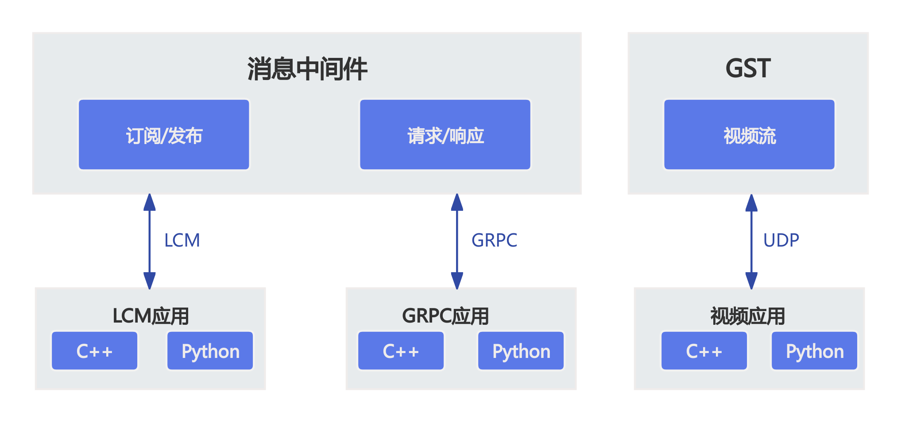

# SDK 概述

## SDK 通信接口介绍

> - 当前软件版本暂不支持 GST 视频流传输

MagicDog 采用 LCM/GRPC/UDP 作为消息中间件，主要数据交互模式：话题（订阅/发布）和 RPC（请求/响应）
- 话题（订阅/发布）：接收方订阅某个消息，发送方根据订阅列表向接收方发送消息，主要用于中高频率或持续性的数据交互。
- RPC（请求/响应）：采用问答模式，通过请求实现数据获取或操作控制，用于低频率或功能切换时的数据交互。

话题和 RPC 接口的主要调用方式：函数式接口
- 函数式接口：将 API 调用封装为函数调用，方便用户使用。

## 获取 SDK

magicdog-sdk 是魔法原子新一代机器人开发 SDK。该 SDK 将高层运动控制、底层电机控制、语音控制等接口进行了完整封装，并提供了相应的函数式接口。
您可以参考我们提供的 SDK 教程，学习机器人控制方法，完成 MagicDog 的二次开发。

### SDK 下载地址：

[magicbdog-sdk](https://github.com/MagiclabRobotics/magicdog_sdk)

> - Notice:  官网文档上部分接口和类型可能由于官网上线节奏落后于Github迭代节奏，请以Github接口和类型定义为准；

### URDF/MJCF 下载地址:

[URDF/MJCF](https://github.com/MagiclabRobotics/magicdog_description)

