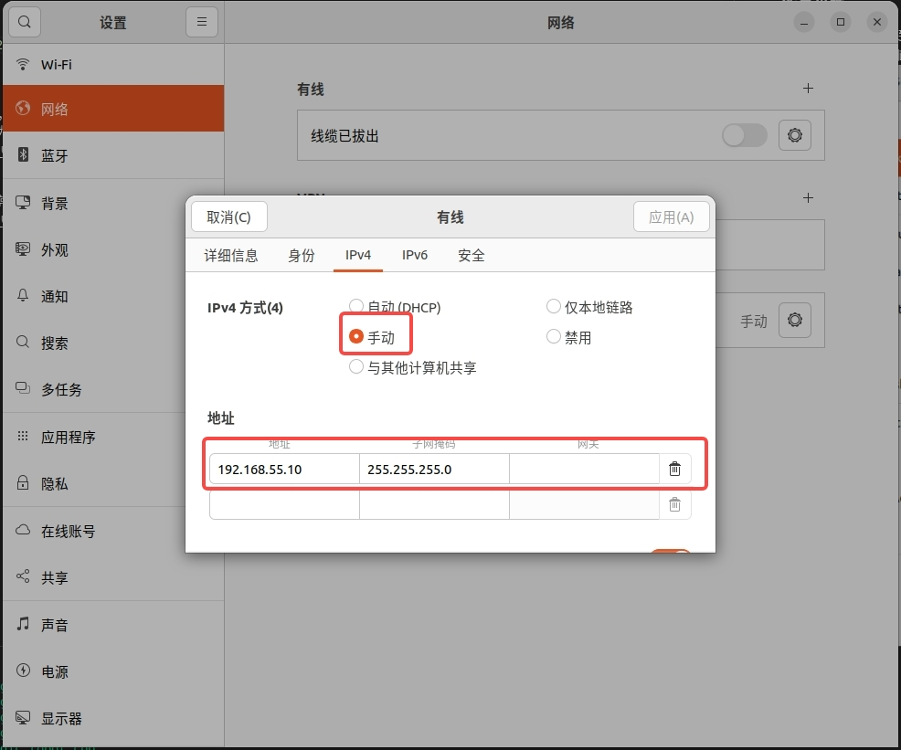
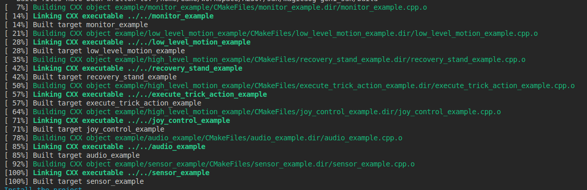

# 快速开始

## 系统环境
推荐在 Ubuntu 22.04 系统下开发，暂不支持 Mac/Windows 系统下开发。机器人本体 PC 运行官方服务，不支持开发环境。

### 开发环境要求
- GCC ≥ 11.4 (for Linux)
- CMake ≥ 3.16
- Make build system
- C++20 (minimum)
- Eigen3
- python3.10

### 第三方库依赖
```
sudo apt update
sudo apt install libgrpc++-dev libgrpc-dev liblcm-dev libyaml-cpp-dev libsystemd-dev -y
sudo apt install cmake python3 python3-dev python3-pip libeigen3-dev build-essential -y
```

### 系统配置

首先，为了实现普通用户下通信实时性，需要在`/etc/security/limits.conf`文件中增加如下配置：
```bash
*    -   rtprio   98
```

其次，为了增加每个socket链接的接收缓存，需要在`/etc/sysctl.conf`文件中增加如下配置，`sudo sysctl -p`立即生效或重启生效：
```bash
net.core.rmem_max=20971520  
net.core.rmem_default=20971520  
net.core.wmem_max=20971520  
net.core.wmem_default=20971520  
```

## 网络环境
将用户计算机与机器人交换机接入统一网络。建议新用户使用网线将用户计算机接入机器人交换机，并将与机器人通信的网卡设置在 192.168.55.X 网段下，推荐使用 192.168.55.10。有经验的用户可自行配置网络环境。

假设 SDK 二次开发 PC 与机器人连接的网口为 `eno1`，需要进行如下配置以便 SDK 与机器人的底层通信：

```bash
 sudo ifconfig eno1 multicast
 sudo route add -net 224.0.0.0 netmask 240.0.0.0 dev eno1
```

### 配置步骤
1. 用网线的一端连接机器人，另一端连接用户电脑。机器人机载电脑的 IP 地址为 192.168.55.200，所以需要将电脑 ip 设置为同一网段，建议 192.168.55.10。



2. 为了测试通信连接是否正常，可以通过 ping 进行测试：


3. 连通后，执行以下命令

```bash
 sudo ifconfig eno1 multicast
 sudo route add -net 224.0.0.0 netmask 240.0.0.0 dev eno1
```

## 安装与编译

> 以下步骤假设工作目录为`/home/magicbot/workspace`

### 安装 magicdog-sdk

```
cd /home/magicbot/workspace/magicdog_sdk/
mkdir build
cd build
cmake .. -DCMAKE_INSTALL_PREFIX=/opt/magic_robotics/magicdog_sdk
make -j8
sudo make install
```

>上述命令会把 `magicdog_sdk` 安装到 `/opt/magic_robotics/magicdog_sdk` 目录下

### 例程编译
```
cd /home/magicbot/workspace/magicdog_sdk/
mkdir build
cd build
cmake .. -DBUILD_EXAMPLES=ON
make -j8
```

运行上述命令后，若进度进行到 100% 且没有报错，则意味着编译成功。



### 用户模块导入 magicdog-sdk

如果用户需要在自己的模块中引入 `magicdog-sdk`，可以参考 `example/cmake_example/CMakeLists.txt`

## C++ 例程示例

magicdog_sdk/build目录中：

- **语音示例**:
  - audio_example
- **传感器示例**:
  - sensor_example
- **状态监控示例**:
  - monitor_example
- **底层运控示例**:
  - low_level_motion_example
- **高层运控示例**:
  - high_level_motion_example

### 进入调试模式：

按照操作流程，确保机器人进入调试模式

### 运行例程

进入 magicdog_sdk/build 目录，执行如下命令：

```bash
cd /home/magicbot/workspace/magicdog_sdk/build
# 环境配置
sudo ifconfig eno1 multicast
sudo route add -net 224.0.0.0 netmask 240.0.0.0 dev eno1
export LD_LIBRARY_PATH=/opt/magic_robotics/magicdog_sdk/lib:$LD_LIBRARY_PATH

# 语音示例
./audio_example

# 传感器示例
./sensor_example

# 状态监控示例
./monitor_example

# 底层运控示例
./low_level_motion_example

# 高层运控示例
./high_level_motion_example
```

## Python 例程示例

magicdog_sdk/example/python目录中：

- **语音示例**:
  - audio_example.py
- **传感器示例**:
  - sensor_example.py
- **状态监控示例**:
  - monitor_example.py
- **底层运控示例**:
  - low_level_motion_example.py
- **高层运控示例**:
  - high_level_motion_example.py

### 进入调试模式：

按照操作流程，确保机器人进入调试模式

### 运行例程

进入magicdog_sdk/example/python目录，执行如下命令：

``` bash
cd /home/magicbot/workspace/magicdog_sdk/example/python/

# 环境配置
sudo ifconfig eno1 multicast
sudo route add -net 224.0.0.0 netmask 240.0.0.0 dev eno1
export PYTHONPATH=/opt/magic_robotics/magicdog_sdk/lib:$PYTHONPATH
export LD_LIBRARY_PATH=/opt/magic_robotics/magicdog_sdk/lib:$LD_LIBRARY_PATH

# 语音示例
python3 audio_example.py

# 传感器示例
python3 sensor_example.py

# 状态监控示例
python3 monitor_example.py

# 底层运控示例
python3 low_level_motion_example.py

# 高层运控示例
python3 high_level_motion_example.py
```

> 注意：手动执行 `sudo route add -net 224.0.0.0 netmask 240.0.0.0 dev eno1` 只会生效一次，开机重启或者网线断连之后，需要重新执行


获取python api帮助信息：

```bash
cd /home/magicbot/workspace/magicdog_sdk/example/python
# 环境配置
export PYTHONPATH=/opt/magic_robotics/magicdog_sdk/lib:$PYTHONPATH
export LD_LIBRARY_PATH=/opt/magic_robotics/magicdog_sdk/lib:$LD_LIBRARY_PATH

$ python3
Python 3.10.12 (main, Aug 15 2025, 14:32:43) [GCC 11.4.0] on linux
Type "help", "copyright", "credits" or "license" for more information.
# 导入Magicdog python SDK接口
>>> import magicdog_python
# 查看所有接口信息             
>>> help(magicdog_python)
# 查看CameraInfo结构信息 
>>> help(magicdog_python.CameraInfo)
# 查看HighLevelMotionController对象信息 
>>> help(magicdog_python.HighLevelMotionController)
# 查看LowLevelMotionController对象信息 
>>> help(magicdog_python.LowLevelMotionController)
# 查看SensorController对象信息 
>>> help(magicdog_python.SensorController)
# 查看AudioController对象信息 
>>> help(magicdog_python.AudioController)
# 查看StateMonitor对象信息 
>>> help(magicdog_python.StateMonitor)
```

比如，如果想查看特技动作 `TrickAction` 的枚举值：

```bash
$ python3
Python 3.10.12 (main, Aug 15 2025, 14:32:43) [GCC 11.4.0] on linux
Type "help", "copyright", "credits" or "license" for more information.
>>> import magicdog_python
>>> help(magicdog_python.TrickAction)

Help on class TrickAction in module magicdog_python:

class TrickAction(pybind11_builtins.pybind11_object)
 |  Method resolution order:
 |      TrickAction
 |      pybind11_builtins.pybind11_object
 |      builtins.object
 |  
 |  Methods defined here:
 |  
 |  __eq__(...)
 |      __eq__(self: object, other: object, /) -> bool
 |  
 |  __getstate__(...)
 |      __getstate__(self: object, /) -> int
 |  
 |  __hash__(...)
 |      __hash__(self: object, /) -> int
 |  
 |  __index__(...)
 |      __index__(self: magicdog_python.TrickAction, /) -> int
 |  
 |  __init__(...)
 |      __init__(self: magicdog_python.TrickAction, value: typing.SupportsInt) -> None
 |  
 |  __int__(...)
 |      __int__(self: magicdog_python.TrickAction, /) -> int
 |  
 |  __ne__(...)
 |      __ne__(self: object, other: object, /) -> bool
 |  
 |  __repr__(...)
 |      __repr__(self: object, /) -> str
 |  
 |  __setstate__(...)
 |      __setstate__(self: magicdog_python.TrickAction, state: typing.SupportsInt, /) -> None
 |  
 |  __str__(...)
 |      __str__(self: object, /) -> str
 |  
 |  ----------------------------------------------------------------------
 |  Readonly properties defined here:
 |  
 |  __members__
 |  
 |  name
 |      name(self: object, /) -> str
 |  
 |  value
 |  
 |  ----------------------------------------------------------------------
 |  Data and other attributes defined here:
 |  
 |  ACTION_ACT_CUTE = <TrickAction.ACTION_ACT_CUTE: 46>
 |  
 |  ACTION_BACK_FLIP = <TrickAction.ACTION_BACK_FLIP: 41>
 |  
 |  ACTION_BACK_HOME = <TrickAction.ACTION_BACK_HOME: 110>
 |  
 |  ACTION_BOXING = <TrickAction.ACTION_BOXING: 47>
 |  
 |  ACTION_CHEER_UP = <TrickAction.ACTION_CHEER_UP: 35>
 |  
 |  ACTION_DANCE = <TrickAction.ACTION_DANCE: 115>
 |  
 |  ACTION_DANCE2 = <TrickAction.ACTION_DANCE2: 91>
 |  
 |  ACTION_EMERGENCY_STOP = <TrickAction.ACTION_EMERGENCY_STOP: 101>
 |  
 |  ACTION_FRONT_FLIP = <TrickAction.ACTION_FRONT_FLIP: 42>
 |  
 |  ACTION_HAPPY_NEW_YEAR = <TrickAction.ACTION_HAPPY_NEW_YEAR: 105>
 |  
 |  ACTION_HIGH_FIVES = <TrickAction.ACTION_HIGH_FIVES: 36>
 |  
 |  ACTION_HIGH_JUMP = <TrickAction.ACTION_HIGH_JUMP: 38>
 |  
 |  ACTION_IMITATE = <TrickAction.ACTION_IMITATE: 32>
 |  
 |  ACTION_JUMP_FRONT = <TrickAction.ACTION_JUMP_FRONT: 45>
 |  
 |  ACTION_JUMP_JACK = <TrickAction.ACTION_JUMP_JACK: 30>
 |  
 |  ACTION_LEAP_FROG = <TrickAction.ACTION_LEAP_FROG: 40>
 |  
 |  ACTION_LEAVE_HOME = <TrickAction.ACTION_LEAVE_HOME: 111>
 |  
 |  ACTION_LEFT_SIDE_SOMERSAULT = <TrickAction.ACTION_LEFT_SIDE_SOMERSAULT...
 |  
 |  ACTION_LIE_DOWN = <TrickAction.ACTION_LIE_DOWN: 102>
 |  
 |  ACTION_NONE = <TrickAction.ACTION_NONE: 0>
 |  
 |  ACTION_PUSH_UP = <TrickAction.ACTION_PUSH_UP: 34>
 |  
 |  ACTION_RANDOM_DANCE = <TrickAction.ACTION_RANDOM_DANCE: 49>
 |  
 |  ACTION_RECOVERY_STAND = <TrickAction.ACTION_RECOVERY_STAND: 103>
 |  
 |  ACTION_RIGHT_SIDE_SOMERSAULT = <TrickAction.ACTION_RIGHT_SIDE_SOMERSAU...
 |  
 |  ACTION_ROLL_ABOUT = <TrickAction.ACTION_ROLL_ABOUT: 116>
 |  
 |  ACTION_SCRATCH = <TrickAction.ACTION_SCRATCH: 37>
 |  
 |  ACTION_SHAKE_HEAD = <TrickAction.ACTION_SHAKE_HEAD: 33>
 |  
 |  ACTION_SHAKE_LEFT_HAND = <TrickAction.ACTION_SHAKE_LEFT_HAND: 118>
 |  
 |  ACTION_SHAKE_RIGHT_HAND = <TrickAction.ACTION_SHAKE_RIGHT_HAND: 117>
 |  
 |  ACTION_SIDE_SOMERSAULT = <TrickAction.ACTION_SIDE_SOMERSAULT: 48>
 |  
 |  ACTION_SIT_DOWN = <TrickAction.ACTION_SIT_DOWN: 119>
 |  
 |  ACTION_SLOW_GO_BACK = <TrickAction.ACTION_SLOW_GO_BACK: 109>
 |  
 |  ACTION_SLOW_GO_FRONT = <TrickAction.ACTION_SLOW_GO_FRONT: 108>
 |  
 |  ACTION_SPACE_WALK = <TrickAction.ACTION_SPACE_WALK: 31>
 |  
 |  ACTION_SPIN_JUMP_LEFT = <TrickAction.ACTION_SPIN_JUMP_LEFT: 43>
 |  
 |  ACTION_SPIN_JUMP_RIGHT = <TrickAction.ACTION_SPIN_JUMP_RIGHT: 44>
 |  
 |  ACTION_STOMP = <TrickAction.ACTION_STOMP: 29>
 |  
 |  ACTION_STRETCH = <TrickAction.ACTION_STRETCH: 28>
 |  
 |  ACTION_SWING_BODY = <TrickAction.ACTION_SWING_BODY: 27>
 |  
 |  ACTION_SWING_DANCE = <TrickAction.ACTION_SWING_DANCE: 39>
 |  
 |  ACTION_TURN_AROUND = <TrickAction.ACTION_TURN_AROUND: 112>
 |  
 |  ACTION_WIGGLE_HIP = <TrickAction.ACTION_WIGGLE_HIP: 26>
 |  
 |  ----------------------------------------------------------------------
 |  Static methods inherited from pybind11_builtins.pybind11_object:
 |  
 |  __new__(*args, **kwargs) from pybind11_builtins.pybind11_type
 |      Create and return a new object.  See help(type) for accurate signature.
```

## 其他

### SDK 配置文件

SDK运行时默认会在/tmp目录下生成其默认配置文件，如果配置文件已存在则使用已有配置：

```
$ ls /tmp/magicdog_mjrrt.yaml
/tmp/magicdog_mjrrt.yaml
```

### SDK日志

SDK运行时内部的日志信息默认生成在/tmp/logs目录下：
```
$ ls /tmp/logs/magicdog_sdk.log
/tmp/logs/magicdog_sdk.log
```